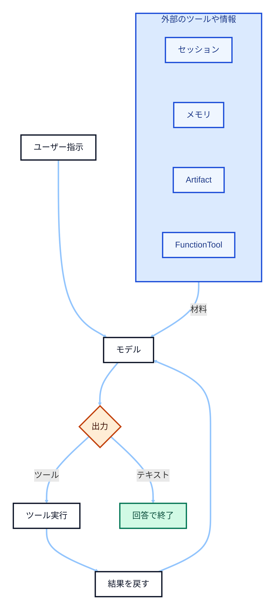

# Google ADK で AI エージェントを作成

- **このメモの役割**：ADK（Python）の**部品・用語・流れ**を、あとから口頭や別資料で説明するときの**目次**として使う

---

## 1. AI エージェントとは（この資料での整理）

- **バックボーン**：LLM
- **拡張**：ツール、記憶、マルチエージェント
- **目的**：ゴールに向け、状況に応じて次の一手を変えながら複数ステップで進める
- **見え方**：調査・ツール呼び出しの**繰り返し**で「長い行動」になる

---

## 2. フレームワーク周りの典型的なループ（ADK 含む多くの実装）

- **①** ユーザーが指示する
- **②** フレームワークが **コンテキスト**（会話・設定など、モデルへ渡す情報のまとまり）を組み、モデルへリクエスト
- **③** モデル出力はだいたい次のどちらか  
  - **回答テキスト** → ユーザーへ返して終了  
  - **ツール呼び出し**（どれに・何を渡すか）→ 実行 → 結果をモデルへ戻す → **③へ戻る**
- **④** ③の反復で「多段の行動」に見える



- **要点**：フレームワークに返すのは **「ユーザーへのメッセージ」** か **「ツール呼び出し指示」** の二択、という整理

**ADK が肩代わりしがちなこと**

- **セッション**（対話履歴）、**メモリ**、**アーティファクト**（添付ファイルなど）の**取りまとめ**
- **ツール化**：例）`FunctionTool` で Python 関数を登録

---

## 3. 用語について

### ツール

- **意味**：モデルが必要に応じて呼ぶ **外部の能力**（関数、API、検索、DB など）
- **ADK**：`FunctionTool` 等で登録 → モデルがツール名・引数 → 実行結果が会話に戻る

### サブエージェント

- **意味**：親とは **別のエージェント** に一部業務を任せる
- **狙い**：役割分割・専門化（プロンプトやツールを分けやすい）

### agent as tool

- **意味**：サブエージェントを、親からは **1 つのツール** として呼ぶパターン
- **流れ**：入力 → サブが内部で推論・ツール利用 → **結果が1回のツール応答**のように返る

---

## 4. マルチエージェントの種類

- **シーケンシャル**：**順番**実行・前の出力が次の入力（パイプライン）
- **ループ**：**繰り返し**・品質確認や「条件を満たすまで」など
- **パラレル**：**同時**に複数動かし、あとで結果を束ねる（並列調査など）

---

## 5. セッションとメモリの違い

- **セッション**：**この対話（スレッド）**を続けるための文脈（メッセージ履歴など）
- **メモリ**：**会話をまたいで**使う知識・要約（好み、確定事実、長期要約など）

---

## 6. プロジェクト作成と `google-adk` の導入（uv）

- **確認**：`uv --version`（例：`uv 0.9.9`）
- **`uv init`**：`pyproject.toml` 付きのプロジェクトができる **手元の例**：`0_base/adk` で `uv init adk_project_01` → `adk_project_01/` に展開
- **注意**：`uv add` は **`pyproject.toml` があるディレクトリで**実行する  
  - プロジェクトの**親フォルダ**で `uv add google-adk` すると `No pyproject.toml` で失敗する

**コマンドの流れ（例）**

```powershell
cd <フォルダパス>
uv init adk_project_01
cd adk_project_01
uv add google-adk
```

プロジェクトをつくった後の詳しい手順はadk_project_01\README.mdを参照

---
